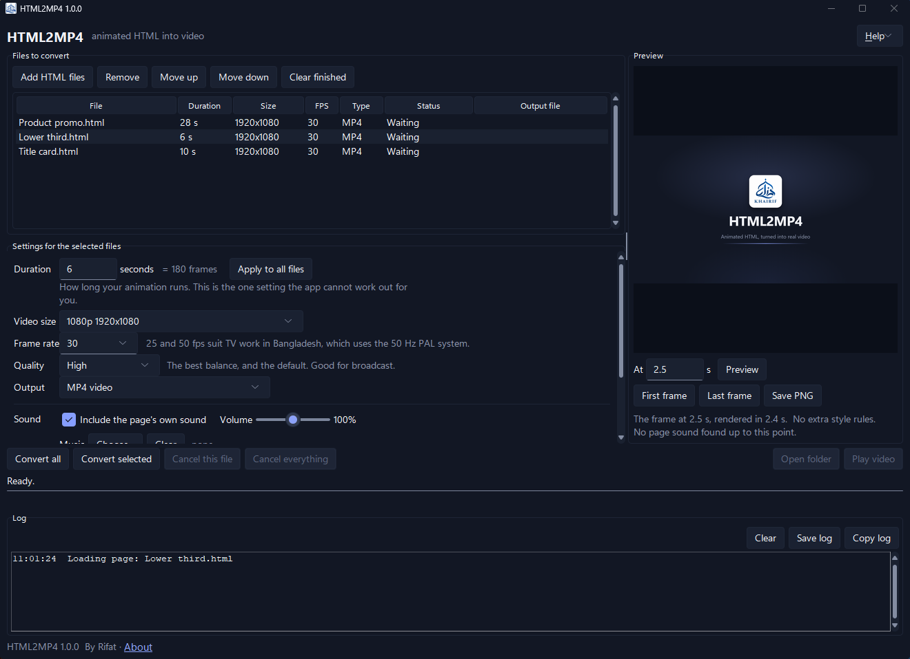
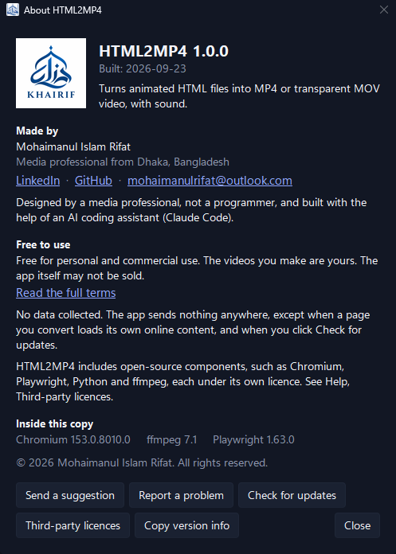

# HTML2MP4

**Animated HTML, turned into real video. Free, for Windows.**


## Download

**[Download HTML2MP4 1.0.0](https://github.com/mohaimanulrifat/HTML2MP4/releases/latest)**  (zip, 287 MB)

Windows 10 or 11, 64-bit. Nothing to install: no Python, no browser, no ffmpeg, no account.

## What it does

- Turns an animated HTML page into an **MP4**, or a see-through **MOV** you can lay over other footage in an editor.
- Draws and photographs **every single frame**, so the video matches the page exactly, every time, on any PC.
- Captures the **page's own sound**, and can add a **music track** with a fade.
- Converts **a whole list of files** while you carry on working.
- Shows you **any moment** of the video as a still picture, before you convert.



## Quick start

1. **Download** the zip from the link above.
2. **Unblock it first.** Right-click the zip, choose Properties, and if you see "This file came from another computer and might be blocked", tick **Unblock**, then OK. Do this before unzipping.
3. **Unzip** it somewhere you can write to, such as your Documents folder or `C:\Apps\`. Avoid `C:\Program Files`.
4. Open the `HTML2MP4` folder and double-click **HTML2MP4.exe**.
5. If Windows shows a blue box saying "Windows protected your PC", click **More info**, then **Run anyway**. See the FAQ below for why that appears.
6. Click **Add HTML files**, choose your file, set **Duration** to how long your animation runs, and click **Convert all**.

The video is saved next to your HTML file, with the same name: `My Promo.html` becomes `My Promo.mp4`.

## Features

- MP4 up to 4K, 25 to 60 frames per second, four quality settings.
- Transparent MOV (ProRes 4444) for overlays.
- Page sound captured automatically, plus your own music track with fade in and out.
- A queue, so a whole batch converts unattended.
- A preview of any moment, without making the whole video.
- A tick box that hides the playback bar and border some design tools add around an exported page.
- A plain-language log that says what went wrong, and where.
- Remembers your settings between runs.

## Tips

- **Duration is the one setting the app cannot work out for you.** If your animation runs 12 seconds, put 12.
- **Use Preview** before converting a long one. Type a time, press Preview, and check that moment looks right.
- **Transparent MOV files are very large.** They are meant for editing, not for sharing.
- **Music is trimmed** to the length of the video and fades out over the last 2 seconds by default.
- **If the video has a playback bar or a black border in it**, tick "Hide preview toolbars that design tools add around a design".

## Known limitations

These are known and deliberate, not faults:

- MP4 (H.264) video clips **inside** a page cannot be shown, because the bundled open-source Chromium has no H.264 decoder. The log names the clip. Convert it to WebM and point your page at that. Page sound is not affected.
- Other video clips inside a page are not frame-synced and may look wrong.
- Sound a page creates from nothing, with an oscillator rather than a sound file, is not captured. The app says so and suggests using the music track.
- Visuals that react to sound, using an analyser, will not react.
- Content from another website inside your page, a YouTube embed for instance, may not appear correctly.
- Animated SVG used as an image may look frozen.
- Fonts and scripts loaded from the internet need a connection at the time you convert.
- The browser inside the app does not update itself, on purpose: your videos look the same next year as they do today.

## Privacy

No data collected. The app sends nothing anywhere, except when a page you convert loads its own online content, and when you click Check for updates.

Your HTML files, your videos and your settings stay on your PC.

## Questions

**Is it really free?**
Yes, for personal and commercial work. The videos you make are yours. See [TERMS.md](TERMS.md).

**Why does Windows warn me about it?**
The app is not signed with a paid code-signing certificate, and Windows has not seen it on many PCs yet, so it shows a warning for programs it does not recognise. The warning says nothing about what the program does. You can check your download against the published checksum, below.

**Is the source code available?**
No. The app is free to use, but the code is private. The open-source parts inside it keep their own licences, listed in [THIRD_PARTY_NOTICES.md](THIRD_PARTY_NOTICES.md).

**Does it work offline?**
Yes. The only exception is a page of yours that loads fonts, scripts or sounds from the internet while it is being converted.

**Where are my videos saved?**
Next to the HTML file, with the same name. Settings and logs sit next to `HTML2MP4.exe`, and the Help menu can open either folder for you.

**How do I check my download?**
Open PowerShell in the folder where the zip is and run:

```powershell
Get-FileHash .\HTML2MP4-1.0.0-win64.zip -Algorithm SHA256
```

Compare what it prints with the line for that file in `SHA256SUMS.txt` on the release page. If they match, the file is exactly the one that was published.

**How long does a conversion take?**
Roughly five minutes for each minute of finished video at 1080p and 60 fps, because every frame is drawn and photographed one at a time. You can keep using your PC while it works.

## Suggestions and problems

- [Send a suggestion](https://github.com/mohaimanulrifat/HTML2MP4/issues/new?template=suggestion.yml)
- [Report a problem](https://github.com/mohaimanulrifat/HTML2MP4/issues/new?template=bug_report.yml)

Both are short forms. For a problem, the app's **Help, About, Copy version info** gives you the details to paste in.

No GitHub account? Email **mohaimanulrifat@outlook.com**.

If you attach a log, read through it first: it contains the names and folders of your own files.

## About

Made by **Mohaimanul Islam Rifat**, a media professional from Dhaka, Bangladesh.

I make animated promos and titles as HTML, and kept needing them as video files. I am not a programmer. I designed this app and built it with the help of an AI coding assistant (Claude Code), then tested it on my own work until it was reliable enough to share.

- LinkedIn: [md-mohaimanul-islam](https://www.linkedin.com/in/md-mohaimanul-islam)
- Email: mohaimanulrifat@outlook.com



## Terms and notices

- [Terms of use](TERMS.md): free for personal and commercial work, the videos are yours, the app may not be sold, and it comes with no warranty.
- [Third-party notices](THIRD_PARTY_NOTICES.md): the open-source parts inside the app, with their versions and licences. The full licence texts are in the `licenses` folder beside `HTML2MP4.exe`, and under Help, Third-party licences in the app.
- [What changed](CHANGELOG.md)

© 2026 Mohaimanul Islam Rifat. All rights reserved.
